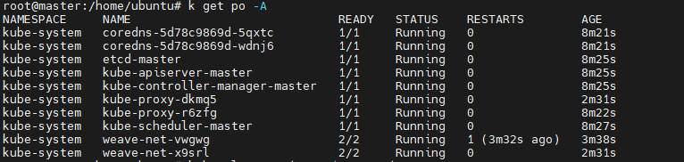
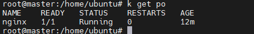
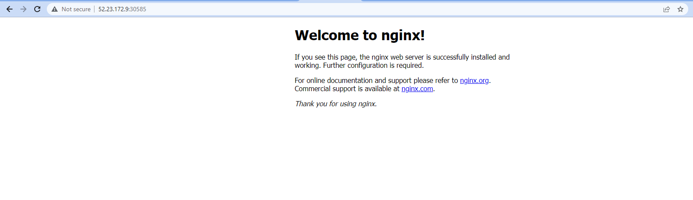
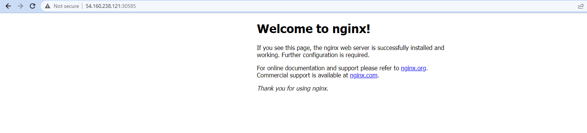

# Kubernetes Cluster Setup with containerd on 2023

Cluster Setup on AWS using Kubeadm

* A compatible Linux host
* 2 GB or more of RAM per machine and 2 CPUs or more
* Full network connectivity between all machines in the cluster
* Unique hostname, MAC address for each node
* Certain ports are open on your machines
* Swap disabled. You MUST disable swap for the kubelet to work properly
* Containerd to be installed on all machines

# Validating nginx on a cluster with one node

**master ip**

**node01 ip**

