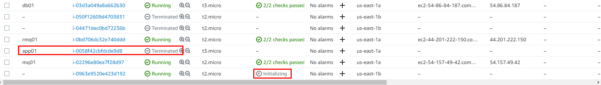
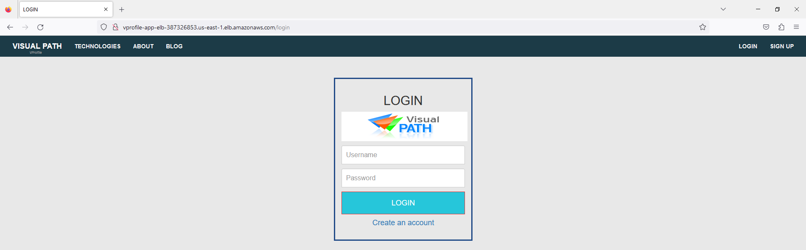

# Devops-Projects-3-AWS-Lift-and-Shift


## BACKEND STACK SETUP


## SG backend


### Db Setup - 3306

```sh
ssh -i ../../Downloads/vprofile-kp.pem centos@13.48.194.215
sudo -i
```
### displaying user-data script

`cat /var/lib/cloud/instances/${instance-id}/user-data.txt`


`systemctl status mariadb`


### Memcached setup - 11211


```
systemctl status memcached
ssh -i ../../Downloads/vprofile-kp.pem centos@16.171.1.184
curl http://169.254.169.254/latest/user-data
ss -tunlp | grep 11211
```


### Rabbitmq setup - 5672


## Updating private ip addresses of the servers in Route53


## Building the artifact locally

Now build the artifact locally and store it in S3 bucket. Then we will download this to our tomcat app server.


`choco install jdk8`

`choco install maven -y`

`choco install awscli -y`

### Configuring aws cli/iam user with full s3 access


`mvn install`


Let's create a bucket and copy our artifact:

```
aws s3 mb s3://devops-projects-artifact-st
aws s3 cp vprofile-v2.war s3://vprofile-artifact-storage-devops/vprofile-v2.war

```

### Creating and attaching an IAM role for tomcat app service

We want to able to download the war file on our app server. 


## Setup App Server

`curl http://169.254.169.254/latest/user-data`


We need to delete default app on tomcat8 and download our war file from s3.


```
sudo -i
apt install awscli -y
systemctl stop tomcat
cd /var/lib/tomcat8/webapps/
rm -rf ROOT
aws s3 ls
aws s3 mb s3://vprofile-artifact-storage-devops
aws s3 cp ./target/vprofile-v2.war s3://vprofile-artifact-storage-devops/vprofile-v2.war

aws s3 cp s3://vprofile-artifact-storage-devops/vprofile-v2.war /tmp/vprofile-v2.war

sudo -i
systemctl stop tomcat9
cd /var/lib/tomcat9/webapps
rm -rf ROOT


cp /tmp/vprofile-v2.war ./ROOT.war
systemctl start tomcat9

cd ROOT
cd /var/lib/tomcat9/webapps/ROOT/WEB-INF/classes
cat application.properties
telnet db01.devops.devtechops.dev 3306

telnet rmq01.devops.devtechops.dev 5672
telnet mq01.devops.devtechops.dev 11211

```

We can check db connection via telnet:


<hr>

## Setup load balancer and target groups


## Auto-scaling and launch templates








## Validation


[pr3-validation.webm](https://github.com/colossus06/20-realtime-devops-projects/assets/96833570/00ec5bdf-4704-483e-925d-21823b535829)


