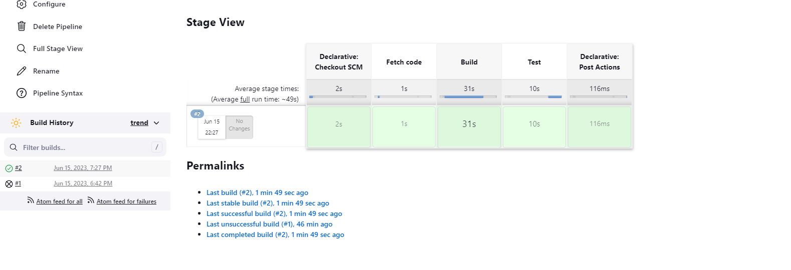
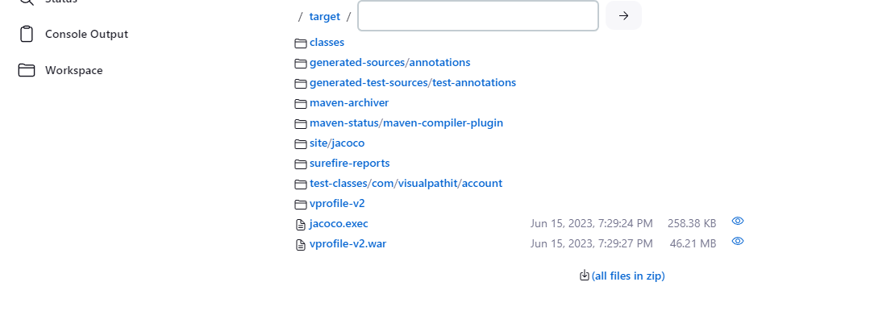

# Continuous Integration Using Jenkins, Nexus, Sonarqube & slack

Before creating a job:

make sure there is 
* jdk8: OracleJDK8 JAVA_HOME: /usr/lib/jvm/java-1.8.0-openjdk-amd64
* and maven: MAVEN3

```sh
sudo apt install openjdk-8-jdk -y
sudo -i
ls /usr/lib/jvm
/usr/lib/jvm/java-1.8.0-openjdk-amd64
```


## Sample Pipeline

Tools:

* Pipeline Utility Steps
* pipeline maven integration




