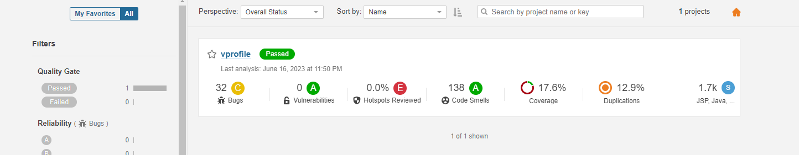

# Continuous Integration Using Jenkins, Nexus, Sonarqube & slack


Install tools:

* maven integration
* github integration
* Nexus Artifact Uploader
* SonarQube ScannerVersion
* Slack Notification
* Build Timestamp


```sh
tail -f /opt/nexus/sonatype-work/nexus3/log/nexus.log
```

## git code migration

```sh
ssh -T git@github.com
git remote set-url origin git@github.com:your-ssh-repo-url
git branch -c ci-jenkins
git checkout ci-jenkins
git push --all origin
```


maven-proxy repo: `https://repo1.maven.org/maven2/`


Grouping the maven repositories:


## Build job with nexus repo

```sh
sudo -i
su - jenkins
git ls-remote -h git@github.com:colossus06/vpro-ci-project.git HEAD
```

fixing illegar character:


## Github Webhook

Add a webhook in github settings:

`http://3.83.88.201:8080/github-webhook/`


#### GitHub hook trigger for GITScm polling and Github Webhook


##  Code Analysis with Sonarqube



### Quality Gates and webhook


## Publish artifact to nexus repo


## Validation

[pr6-validation.webm](https://github.com/colossus06/20-realtime-devops-projects/assets/96833570/5fc56603-81bb-4fd3-90e5-d6a0ab6af0fc)
