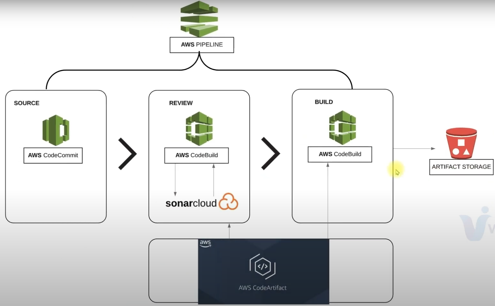
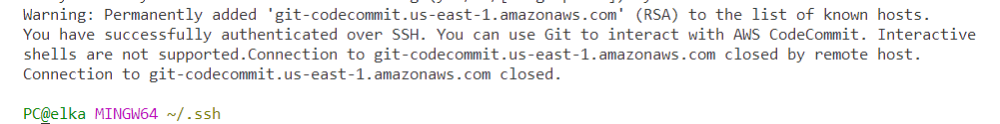
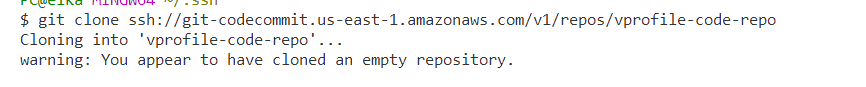
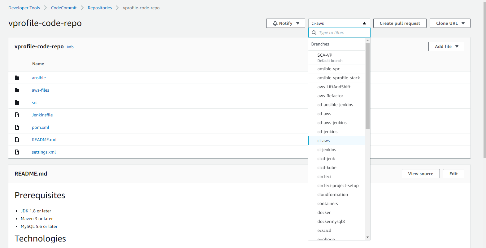
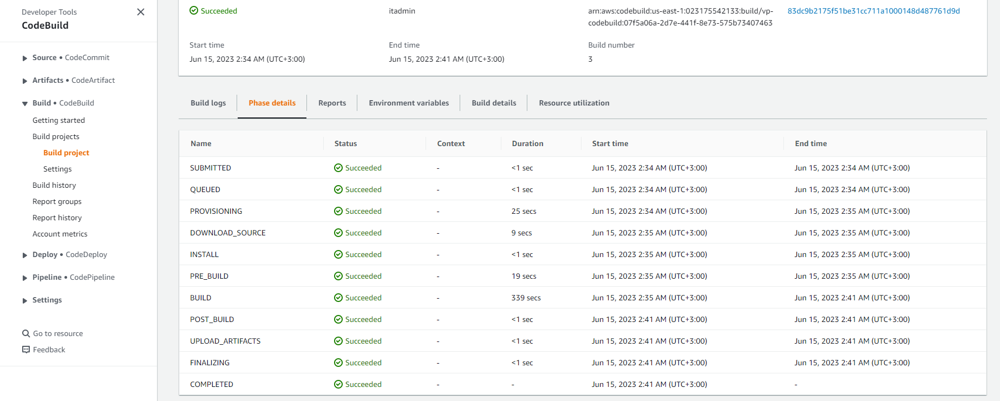
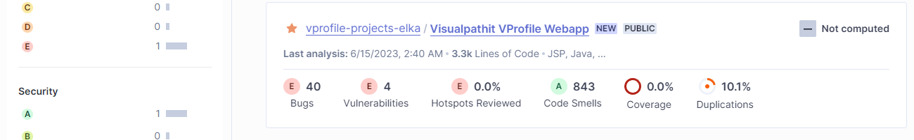
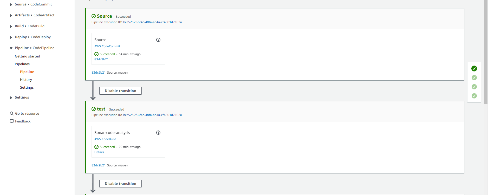
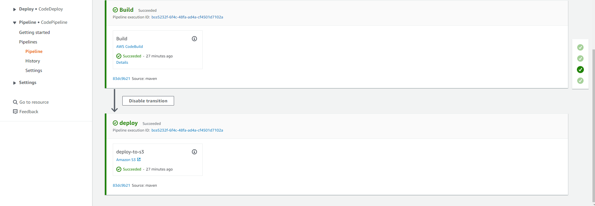
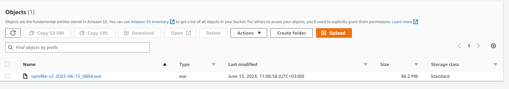

## Continious Integration on AWS Cloud





### Code Commit

```sh
ssh git-codecommit.us-east-1.amazonaws.com
git clone https://github.com/devopshydclub/vprofile-project.git


cat .git/config

git branch -a | grep -v HEAD | cut -d "/" -f3 | grep -v master
for i in `cat branches.txt`;do echo $i;done
for i in `cat branches.txt`;do git checkout $i;done 

git remote rm origin
git remote add origin ssh://git-codecommit.us-east-1.amazonaws.com/v1/repos/repo-name

```











## Code Build




Sonar scanning analysis report:




## CI Validation


Aws cloud based CI solutions:







