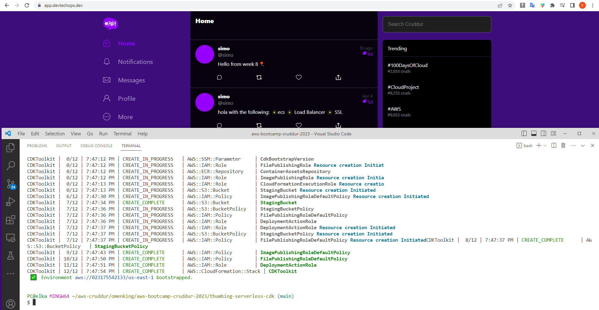

# Week 8 — Serverless Image Processing

This week I worked on the following:

* CDK Stack	
* Configuring and serving avatars via CloudFront	
* Users Profile Page	
* Users Profile Form	
* Backend Migrations	
* Presigned URL generation via Ruby Lambda	


```sh
mkdir thumbing-serverless-cdk 
cd thumbing-serverless-cdk 
npm install aws-cdk -g
cdk init app --language typescript
npm install @types/node --save-dev // because i couldn't get the the node typings.
npm install dotenv
cdk synth
cdk deploy
```


First, I started with previewing the changes ad bootstrapping the environment.




Then I got the following error. 


After a little research, I deleted the toolkit and installed again. Then I could succesfully deploy my stack.

`error: [100%] fail: No bucket named 'cdk-hnb659fds-assets-023175542133-us-east-1'. Is account 023175542133 bootstrapped?`

```sh
cdk list
cdk delete --all
```


`cdk deploy` command created the following resources:


Coming to CloudFront, i realized that my environment variables aren't set correctly. Destroyed and created the stack with the correct variables.

Upload the data.jpg fiel and served with Cloudfront.


**migrations**

`./migration add_bio_column`


Current status of the app is as shown below:


