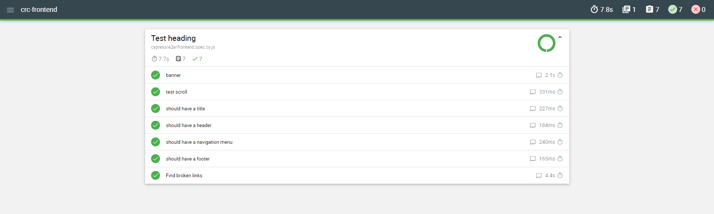

# CRC frontend CICD statuses

* Build Azure Storage and Some Tests:

* Cypress Tests:

https://colossus06.github.io/crc-frontend/

## Validation

[validation-2-crc.webm](https://github.com/colossus06/crc-frontend/assets/96833570/2e3e463b-2ade-4167-9661-f4bda53524bb)

Visit the Resume Site: https://crctopcug.devtechops.dev/

## Summary

Building my resume website from the ground up with using utilizing a wide variety of Microsoft Azure's Cloud services such as Azure CosmosDB Table API, Azure Functions, Azure SDK, Azure Blob Storage, Azure CDN, Azure DNS zones.

Other tools used for automation and CI CD are Cypress, Github Actions, bicep and Terraform.

# Cloud Resume Challenge on Azure

Building my resume website from the ground up with using utilizing a wide variety of Microsoft Azure's Cloud services such as the following:

* Azure CosmosDB Table API serverless mode to store a visitor count value.
* Azure Functions with an HTTP trigger to communicate with CosmosDB from the Javascript code.
* Azure SDK to interact with the database and update counter value.
* Azure Blob Storage for Static Website for serving HTML, CSS, JavaScript, and image files
* Azure CDN to secure version of HTTP, enable custom domain and to cache the content for low latency.
* Azure DNS zones to create and delegate `crctopcug` subdomain point to static website.

Other Tools for Automation/Test/CI-CD:

* Cypress for smoke tests
* Github Actions to update back and frontend on code changes.
* Postman to test API.
* Javascript to display a counter value in main page.
* HTML, CSS, JavaScript.

IaaC

* Terraform to control the state of the resources.

